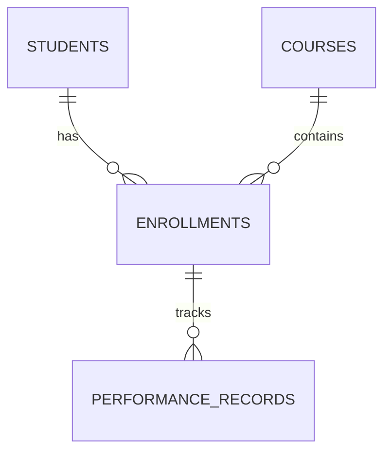

# Database Documentation

## Overview

The student dashboard uses a Supabase PostgreSQL database with the following main entities:
- Students
- Courses
- Enrollments
- Performance Records

## Schema

### Students Table

Stores student information.

```sql
CREATE TABLE students (
  id uuid PRIMARY KEY DEFAULT auth.uid(),
  full_name text NOT NULL,
  email text UNIQUE NOT NULL,
  student_id text UNIQUE NOT NULL,
  created_at timestamptz DEFAULT now(),
  updated_at timestamptz DEFAULT now()
);
```

### Courses Table

Stores course information.

```sql
CREATE TABLE courses (
  id uuid PRIMARY KEY DEFAULT gen_random_uuid(),
  code text UNIQUE NOT NULL,
  name text NOT NULL,
  description text,
  credits integer NOT NULL DEFAULT 3,
  created_at timestamptz DEFAULT now(),
  updated_at timestamptz DEFAULT now()
);
```

### Enrollments Table

Links students to their enrolled courses.

```sql
CREATE TABLE enrollments (
  id uuid PRIMARY KEY DEFAULT gen_random_uuid(),
  student_id uuid REFERENCES students(id) ON DELETE CASCADE,
  course_id uuid REFERENCES courses(id) ON DELETE CASCADE,
  status text NOT NULL DEFAULT 'active',
  enrolled_at timestamptz DEFAULT now(),
  UNIQUE(student_id, course_id)
);
```

### Performance Records Table

Stores student performance data.

```sql
CREATE TABLE performance_records (
  id uuid PRIMARY KEY DEFAULT gen_random_uuid(),
  enrollment_id uuid REFERENCES enrollments(id) ON DELETE CASCADE,
  assessment_type text NOT NULL,
  score numeric NOT NULL CHECK (score >= 0 AND score <= 100),
  recorded_at timestamptz DEFAULT now()
);
```

## Row Level Security (RLS)

### Students Table
- Students can only view their own data
```sql
CREATE POLICY "Students can view their own data"
  ON students FOR SELECT
  TO authenticated
  USING (auth.uid() = id);
```

### Courses Table
- All authenticated users can view courses
```sql
CREATE POLICY "Students can view all courses"
  ON courses FOR SELECT
  TO authenticated
  USING (true);
```

### Enrollments Table
- Students can only view their own enrollments
```sql
CREATE POLICY "Students can view their enrollments"
  ON enrollments FOR SELECT
  TO authenticated
  USING (student_id = auth.uid());
```

### Performance Records Table
- Students can only view their own performance records
```sql
CREATE POLICY "Students can view their performance records"
  ON performance_records FOR SELECT
  TO authenticated
  USING (
    EXISTS (
      SELECT 1 FROM enrollments
      WHERE enrollments.id = performance_records.enrollment_id
      AND enrollments.student_id = auth.uid()
    )
  );
```

## Relationships



## Data Types

- `uuid`: Unique identifiers
- `text`: String data
- `timestamptz`: Timestamps with timezone
- `integer`: Whole numbers
- `numeric`: Decimal numbers (for scores)

## Indexes

Default indexes are created on:
- Primary keys
- Foreign keys
- Unique constraints

## Best Practices

1. Always use the provided RLS policies
2. Use parameterized queries to prevent SQL injection
3. Handle database errors gracefully in the application
4. Use transactions for operations that modify multiple tables
5. Keep performance records within the valid range (0-100)